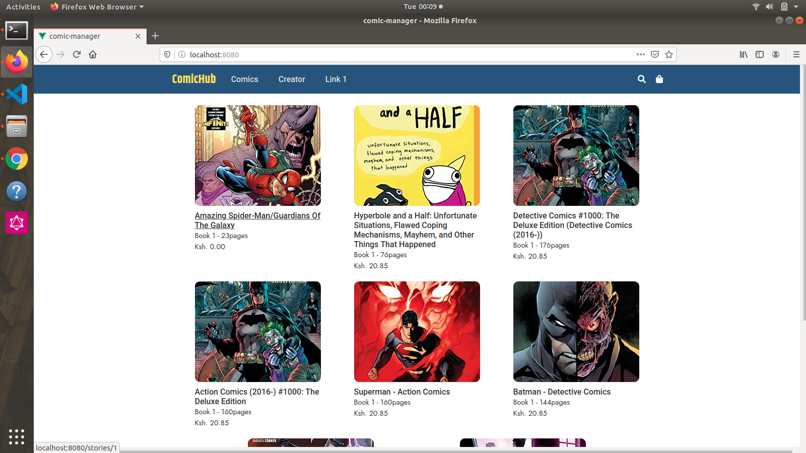
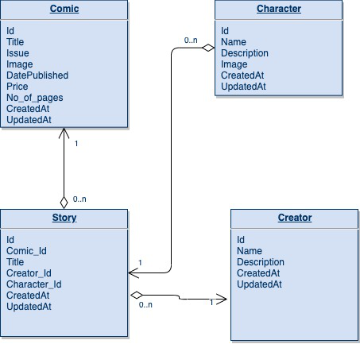

COMIC API
=========================
Developer Setup
-------------------------------

Follow the following steps to setup your  dev environment

Get started with virtual env
----------------------------

Run the following commands to get started using virtualenv

``` shell
# once - create virtual environment
virtualenv env -p python3.6
```

# activate it
source env/bin/activate

# install deps
```
pip install -r requirements.txt
python manage.py createsuperuser
python manage.py migrate
python manage.py runserver

```
Visit List all the APIs documentation
[http://localhost:8080/docs/](http://localhost:8080/docs/)

Visit List all the APIs on localhost
[http://localhost:8080/api/](http://localhost:8080/api/)


Visit List all the APIs on the server
[http://52.49.227.229/api/](http://localhost:8080/api/)


API docs that shows API documentation
[http://52.49.227.229/docs/](http://localhost:8080/docs/)
```

## Project setup Frontend
yarn install

### Compiles and hot-reloads for development

yarn serve
```


### Compiles and minifies for production

yarn build


### Customize configuration
See [Configuration Reference](https://cli.vuejs.org/config/).

# ERD diagram



 
