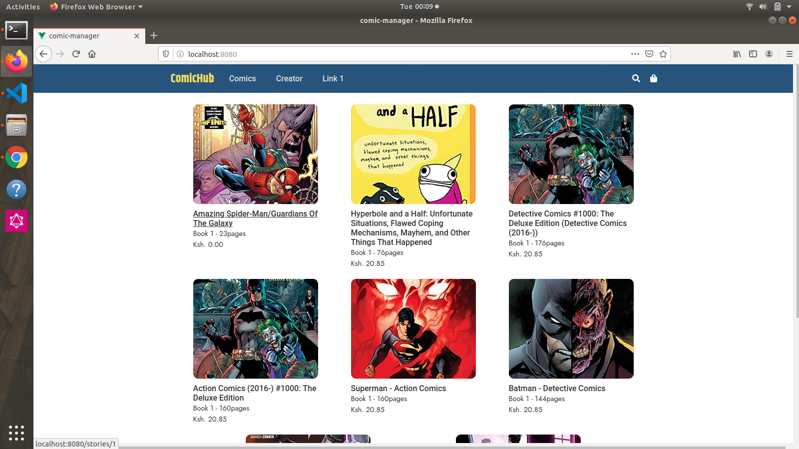

COMIC API
=========================
Developer Setup
-------------------------------

Follow the following steps to setup your  dev environment

Get started with virtual env
----------------------------

Run the following commands to get started using virtualenv

``` shell
# once - create virtual environment
virtualenv env -p python3.6

# activate it
source env/bin/activate

# install deps
pip install -r requirements.txt

#Visit List all the APIs localhost
[http://localhost:8080/api/]

#Visit List all the APIs
[http://18.203.102.108/api/]

# API docs that shows all the endpoints
[http://localhost:8080/docs/]

####Frontend
#comic-manager

## Project setup
```
yarn install
```
### Compiles and hot-reloads for development
```
yarn serve
```


### Compiles and minifies for production
```
yarn build
```
### Lints and fixes files
```
yarn lint
```
### Customize configuration
See [Configuration Reference](https://cli.vuejs.org/config/).

#Data model design
# ERD diagram


 
