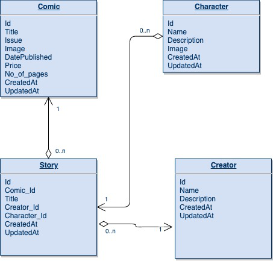

COMIC API
=========================
Developer Setup
-------------------------------

Follow the following steps to setup your  dev environment

Get started with virtual env
----------------------------

Run the following commands to get started using virtualenv

``` shell
# once - create virtual environment
virtualenv env -p python3.6

# activate it
source env/bin/activate

# install deps
pip install -r requirements.txt


# ERD diagram




 
