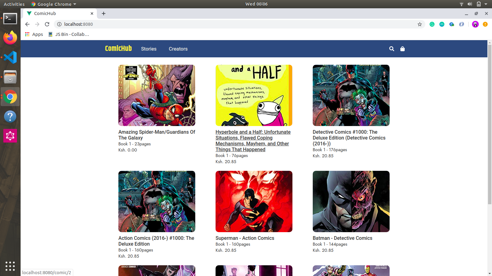
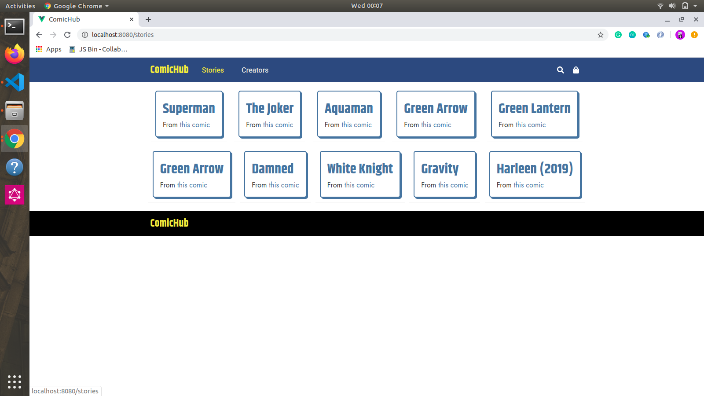
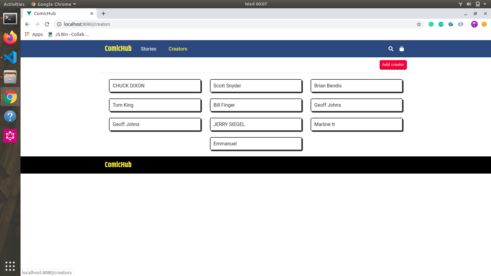

### Well Told Story Interview Solution
###### Writing Well Told story Interview Solution App using Python, Django  Django Rest and VueJs
###### ERD diagram

###### Developer Setup
-------------------------------
Follow the following steps to setup your  dev environment
#### Get started with virtual env
Run the following commands to get started using virtualenv
``` shell
# once - create virtual environment
virtualenv env -p python3.6
```
###### activate it
source env/bin/activate

###### install deps
```
pip install -r requirements.txt
python manage.py createsuperuser
python manage.py makemigrations
python manage.py migrate
python manage.py runserver

```
#### Project setup Frontend
npm install

#### Compiles and hot-reloads for development
npm run serve
```




### Compiles and minifies for production
npm run build
### Customize configuration
See [Configuration Reference](https://cli.vuejs.org/config/).


 
